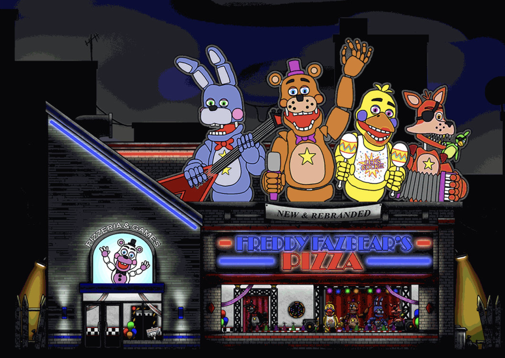

# Emotions Project

Petit jeu d'ambiance en front pur, inspiré de l'univers de Five Nights at Freddy's : on surveille des caméras depuis un bureau, avec des effets de grain, de bruit et de coupure d'image en CSS.

Projet personnel réalisé pour m'entraîner sur les animations CSS et la manipulation du DOM, sans framework.

## Aperçu



## Contenu

| Page | Rôle |
|---|---|
| `index.html` | Écran d'accueil et lancement d'une partie |
| `game.html` | Vue principale du bureau |
| `camera1.html`, `camera2.html` | Vues des caméras de surveillance |
| `camera-off.html` | Écran de caméra hors service, avec effet de bruit |

Les effets visuels (grain, scanlines, transitions, apparitions) sont faits uniquement en CSS, un fichier par écran.

## Stack

- **Vite** comme serveur de développement et bundler
- **JavaScript** natif, sans framework
- **CSS** pour toutes les animations
- Ressources graphiques dans `image/`

## Lancer le projet

```bash
git clone https://github.com/carls-xyz/emotions-project.git
cd emotions-project

npm install
npm run dev
```

Le projet démarre sur l'URL affichée par Vite, en général http://localhost:5173
